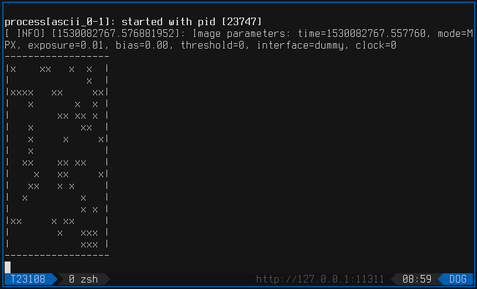
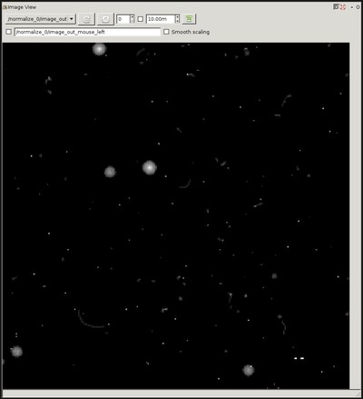

# rospix utils

Sample utilities for basic control of rospix and visualization of the measured data.

# ASCII command line visualization

Inspecting images in the terminal is possible via the _ascii_ utility.

Launching the _ascii_ utility with the desired sensor number:
```bash
roslaunch utils ascii.launch sensor:=0
```



# Image normalizer

To show the images in real time, the _normalizer_ node normalizes its histogram and converts the raw data to visible format.
The images are then republished on _image transport_ topic, which can be subscribed with any image processing utlity, such as *rqt_image_view* or *rviz*.

Launching the _normalizer_ utility with the desired sensor number:
```bash
roslaunch utils normalizer.launch sensor:=0
```



# Exposure control

Sample exposure control utility is provided under the name _controller_.
The utility changes the acquisition time in real time to maintain desired pixel fill in the images.

Launching the _controller_ utility with the desired sensor number:
```bash
roslaunch utils controller.launch sensor:=0
```

# Data saver

The _saver_ can export the measured data in easily parsable CSV file format.
p
Launching the _saver_ utility with the desired sensor number:
```bash
roslaunch utils saver.launch sensor:=0
```
